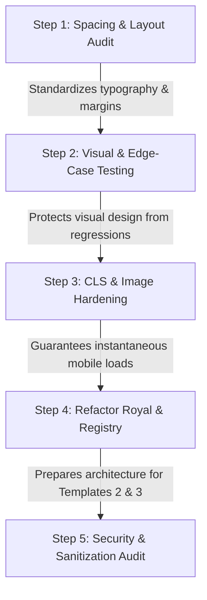

# Implementation Plan: Pixel-Perfect Polish & Scalability Roadmap

Welcome to the **Production Hardening & Perfection** phase of Vivaha Studio. Having shipped E2E smoke tests, the Open Beta pivot, and modular theme/section foundations, the architecture is ready to be refined into a high-performance, bug-free, and pixel-perfect product.

This detailed plan outlines the **Top 5 Steps** to achieve maximum polish, visual perfection, robust security, and seamless scalability *right now*, fully preparing the codebase for the addition of your upcoming two templates.

---

## The Core Roadmap



---

### Step 1: Design QA & Layout Audit (Padding, Margins, and Responsiveness)
**Goal:** Perfect the visual layout, spacing scales, and responsiveness across the marketing shell, invitation editor, and preview drawer on both desktop and mobile. 

*   **Rationale:** Before creating more templates, the layout utilities and structural components must be pixel-perfect so that you don't inherit spacing bugs or alignment inconsistencies in your next designs.
*   **Key Focus Areas:**
    1.  **Strict Spacing Scale:** Audit the root landing page, auth modals, and dashboard panels using a strict `4px`/`8px` grid system. Align card borders, container margins, and flex-gaps.
    2.  **Mobile Editor Drawer:** Polish the live preview drawer on mobile screens. Ensure it handles dynamic heights, drag gestures, and fits within touch targets smoothly without hiding active editor steps.
    3.  **Desktop Editor Shell:** Refactor the split-pane desktop editor (`/dashboard/invitations/[id]/edit`) to ensure the sticky live preview frame is perfectly centered, never overflows the viewport, and preserves a premium aspect ratio on smaller laptop screen resolutions (13"-15").

---

### Step 2: Visual E2E Regression Testing & Edge-Case Playwright Coverage
**Goal:** Expand automated test coverage to guard design layouts and verify editor behaviors when handling edge cases, invalid states, or validation errors.

*   **Rationale:** To guarantee a "bug-free" product, you need automated guardrails. Tests must verify that future styling changes or new templates never break existing layouts.
*   **Key Focus Areas:**
    1.  **Visual Comparison Tests:** Add Playwright visual regression tests (`expect(page).toHaveScreenshot()`) for the homepage, template gallery, and public Royal preview across standard responsive viewports.
    2.  **Editor Validation Edge Cases:** Write E2E tests validating the editor's boundaries:
        - Check autosave feedback behavior during quick multi-character edits.
        - Verify validation states (e.g. blank name field, invalid date strings, incorrect hashtags, or malformed WhatsApp numbers) showing clear, premium error alerts.
    3.  **Interactive Elements Test:** Test complex client-side features, ensuring the curtain intro can be dismissed, the scratch reveal responds beautifully to touch swipes, and the music player state is properly synchronized.

---

### Step 3: Zero CLS, Resource Prefetching, and Mobile Performance Hardening
**Goal:** Optimize Core Web Vitals (specifically Cumulative Layout Shift and Largest Contentful Paint) so invitations load instantly and scroll at a fluid 60 FPS on low-to-mid range mobile devices on slow cellular networks.

*   **Rationale:** First impressions are everything. Guests opening a mobile invitation should see a seamless cinematic experience without layout jumps or loading delays.
*   **Key Focus Areas:**
    1.  **Zero Cumulative Layout Shift (CLS):** Lock in aspect-ratio layouts on all image and media containers (couple portraits, gallery thumbnail grids, venue banners) so elements don't shift when images are lazy-loaded.
    2.  **Fetch Priority & Resource Prefetching:** Set `priority={true}` exclusively on the Hero background image. Add HTML `preconnect` tags in the global layout for Cloudinary and Google Fonts to optimize DNS lookup and TCP handshakes.
    3.  **Scroll and Rerender Polish:** Wrap heavy interactive modules (such as the Countdown, RSVP CTA, and Music Player) in `React.memo` to eliminate redundant redraws during touch scrolling.

---

### Step 4: Refactor "Royal" Template & Shared Section Enforcements
**Goal:** Generalize the `royal` template structure to decouple layout styling from invitation configurations. This cleans the template folder and sets up the exact scaffolds for your next two templates.

*   **Rationale:** Adding Template #2 and Template #3 should take hours, not days. We must abstract reusable components out of Royal and ensure they adhere perfectly to your shared section contracts.
*   **Key Focus Areas:**
    1.  **Abstract Reusable Patterns:** Move common layouts (e.g. elegant section headings, border cards, border dividers, and gold-gradient details) out of `/royal` into `src/templates/shared/sections` or `src/templates/shared/components`.
    2.  **Enforce TS Contracts:** Refactor sections in the Royal template to strictly implement types imported from `src/templates/shared/sections/types.ts`.
    3.  **Registry Extensibility:** Audit `TemplateRenderer.tsx` and `registry.ts` to ensure that adding new template cards to `src/data/templates.ts` instantly plugs them into the preview and editor flows with zero extra configuration.

---

### Step 5: Advanced Security Hardening & Strict Input Sanitization
**Goal:** Guarantee complete data security, prevent potential XSS vulnerabilities, and audit database access to protect users' personal wedding details, maps, and family lists.

*   **Rationale:** A premium "side business" app must be secure and reliable to build trust among real couples.
*   **Key Focus Areas:**
    1.  **Input Sanitization:** Add schema-level sanitization (using library validations or simple regex formatting) on all editor text inputs to filter out html/script payloads before they hit the database.
    2.  **Secure Media Boundaries:** Validate that user-provided image and audio URLs originate strictly from HTTPS and are delivered through safe client elements.
    3.  **RLS Loophole Verification:** Run database policies inspection to ensure no draft invitations, unpublished configurations, or owner metadata are leaked to unauthorized anonymous requests.

---

## Verification & Execution Flow

To ensure high development velocity and safe iterative shipping, use this loop:

1.  **Design & Code Refactor:** Perform the spacing or component polish.
2.  **Local Dev Validation:** Run local checks:
    ```bash
    npm run lint
    npm run build
    ```
3.  **Playwright E2E Execution:** Execute smoke and visual regressions:
    ```bash
    npm run test:e2e
    npm run test:e2e -- --project=mobile-chrome
    ```
4.  **Device QA:** Inspect layout and animation fluidity on actual mobile devices.
